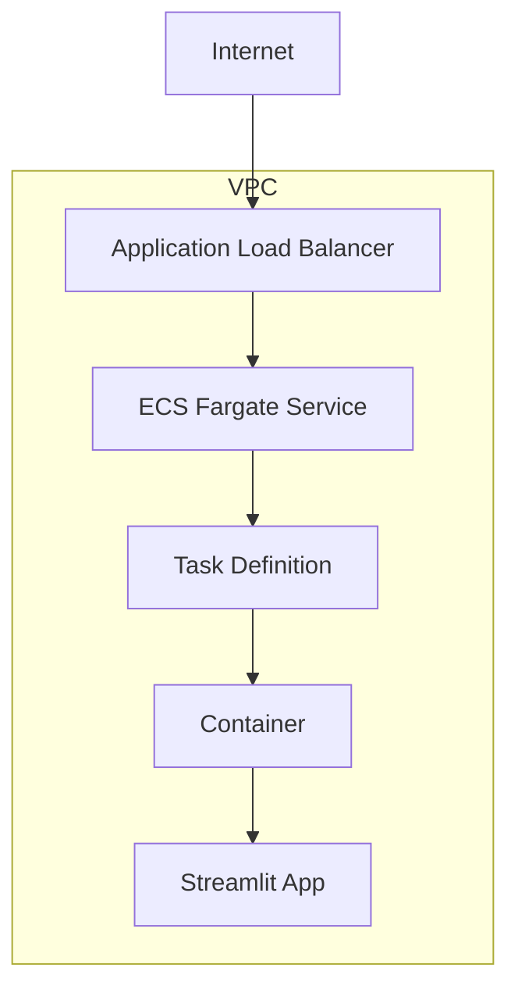

<p align="center">
  
  <h1 align="center">🌟 bolt.Oscar-aws 🌟</h1>
</p>
<p align="center">
  <a href="https://github.com/Sunwood-ai-labs/bolt.Oscar-aws">
    
  </a>
  <a href="https://github.com/Sunwood-ai-labs/bolt.Oscar-aws/blob/main/LICENSE">
    
  </a>
  <a href="https://github.com/Sunwood-ai-labs/bolt.Oscar-aws/stargazers">
    
  </a>
  <a href="https://github.com/Sunwood-ai-labs/bolt.Oscar-aws/releases">
    
  </a>
  <a href="https://github.com/Sunwood-ai-labs/bolt.Oscar-aws/issues">
    
  </a>
  <a href="https://github.com/Sunwood-ai-labs/bolt.Oscar-aws/pulls">
    
  </a>
  <a href="https://github.com/Sunwood-ai-labs/bolt.Oscar-aws/network/members">
    
  </a>
  <a href="https://github.com/Sunwood-ai-labs/bolt.Oscar-aws/watchers">
    
  </a>
  
  
</p>
<h2 align="center">
  ～ Bolt.new AWS Deployment Automation Template ～

<a href="https://github.com/Sunwood-ai-labs/bolt.Oscar-aws/blob/main/README.md"></a>
<a href="https://github.com/Sunwood-ai-labs/bolt.Oscar-aws/blob/main/docs/README.en.md"></a>
</h2>
<p align="center">
  
  
  
  
  
  
  
</p>

> [!IMPORTANT]
>  bolt.Oscarは、[cline (旧:Claude Dev)](https://github.com/clinebot/cline), [SourceSage](https://github.com/Sunwood-ai-labs/SourceSage), [claude.ai](https://claude.ai/)を活用して開発されたリポジトリです。リリースノート、README、コミットメッセージの大部分は、最新のAI技術を用いて生成されています。

## 🚀 プロジェクト概要

bolt.Oscar-awsは、AI駆動の開発環境であるBolt.newをAWS上で迅速に展開するためのインフラストラクチャ自動化テンプレートです。このリポジトリは、以下の機能を提供します：

1. **AWS ECS Fargateを使用した自動デプロイ**
2. **Terraform による完全なインフラストラクチャのコード化**
3. **セキュアなネットワーク構成とロードバランシング**
4. **自動スケーリングとモニタリング**

## 🆕 最新情報

- 🎉 **v1.3.0リリース**: 
  - AWS ECS Fargateデプロイメントの自動化
  - Terraformモジュールの整備
  - セキュリティグループとネットワーク設定の最適化
  - CloudWatchによるロギング機能の追加

## ✨ 主な機能

1. **インフラストラクチャ自動化**:
   - Terraformを使用したAWSリソースの自動プロビジョニング
   - ECS Fargateによるコンテナ化アプリケーションの運用
   - Application Load Balancerによる負荷分散

2. **セキュリティ対策**:
   - VPCとサブネットの適切な設計
   - セキュリティグループによるアクセス制御
   - IAMロールとポリシーの最小権限原則の実装

3. **モニタリングと運用**:
   - CloudWatchによるログ管理
   - アラートとメトリクスの設定
   - 自動スケーリング機能

## 🔧 使用方法

### 前提条件
- AWS CLIのインストールと設定
- Terraformのインストール
- Docker環境の準備

### デプロイ手順

1. リポジトリのクローン:
```bash
git clone https://github.com/Sunwood-ai-labs/bolt.Oscar-aws
cd bolt.Oscar-aws
```

2. Terraform初期化:
```bash
cd Terraform
terraform init
```

3. 設定の確認:
```bash
terraform plan
```

4. デプロイの実行:
```bash
terraform apply
```

## 📦 ディレクトリ構成

```plaintext
├─ Terraform/
│  ├─ main.tf          # メインのTerraform設定
│  ├─ outputs.tf       # 出力値の定義
│  ├─ terraform.tfvars # 変数値の設定
│  ├─ variables.tf     # 変数の定義
│  ├─ whitelist.csv    # IPホワイトリスト
├─ app.py              # Streamlitアプリケーション
├─ README.md
├─ requirements.txt
```

## 🌿 設定カスタマイズ

### terraform.tfvars の設定例:
```hcl
aws_region      = "ap-northeast-1"
project_name    = "bolt-oscar-app"
vpc_cidr        = "10.0.0.0/16"
container_image = "your-docker-image:latest"
task_cpu        = "256"
task_memory     = "512"
app_count       = 1
```

### IPホワイトリストの設定:
`whitelist.csv` を編集してアクセス許可するIPアドレスを管理できます。

## 🐈 アーキテクチャ



## 🤝 コントリビューション

1. このリポジトリをフォーク
2. 機能ブランチを作成 (`git checkout -b feature/amazing-feature`)
3. 変更をコミット (`git commit -m 'Add some amazing feature'`)
4. ブランチにプッシュ (`git push origin feature/amazing-feature`)
5. プルリクエストを作成

## 📄 ライセンス

bolt.Oscar-awsは、[MITライセンス](LICENSE)の下で公開されています。

## 🙏 謝辞

- [Bolt.new](https://github.com/stackblitz/bolt.new) チームに感謝いたします
- Terraformモジュールの開発にあたり、AWSコミュニティからインスピレーションを得ました

---

bolt.Oscar-awsで、Bolt.newの迅速なAWSデプロイを実現しましょう！
