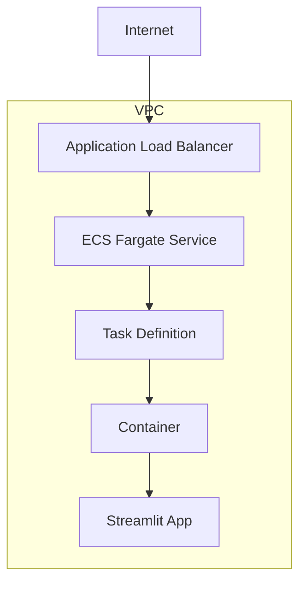

<p align="center">
  
  <h1 align="center">🌟 bolt.Oscar-aws 🌟</h1>
</p>
<p align="center">
  <a href="https://github.com/Sunwood-ai-labs/bolt.Oscar-aws">
    
  </a>
  <a href="https://github.com/Sunwood-ai-labs/bolt.Oscar-aws/blob/main/LICENSE">
    
  </a>
  <a href="https://github.com/Sunwood-ai-labs/bolt.Oscar-aws/stargazers">
    
  </a>
  <a href="https://github.com/Sunwood-ai-labs/bolt.Oscar-aws/releases">
    
  </a>
  <a href="https://github.com/Sunwood-ai-labs/bolt.Oscar-aws/issues">
    
  </a>
  <a href="https://github.com/Sunwood-ai-labs/bolt.Oscar-aws/pulls">
    
  </a>
  <a href="https://github.com/Sunwood-ai-labs/bolt.Oscar-aws/network/members">
    
  </a>
  <a href="https://github.com/Sunwood-ai-labs/bolt.Oscar-aws/watchers">
    
  </a>
  
  
</p>
<h2 align="center">
  ～ Bolt.new AWS Deployment Automation Template ～

<a href="https://github.com/Sunwood-ai-labs/bolt.Oscar-aws/blob/main/README.md"></a>
<a href="https://github.com/Sunwood-ai-labs/bolt.Oscar-aws/blob/main/docs/README.en.md"></a>
</h2>
<p align="center">
  
  
  
  
  
  
  
</p>

> [!IMPORTANT]
>  bolt.Oscar is a repository developed using [cline (formerly Claude Dev)](https://github.com/clinebot/cline), [SourceSage](https://github.com/Sunwood-ai-labs/SourceSage), and [claude.ai](https://claude.ai/).  Most of the release notes, README, and commit messages were generated using the latest AI technologies.

## 🚀 Project Overview

bolt.Oscar-aws is an infrastructure automation template for rapidly deploying the AI-driven development environment Bolt.new on AWS. This repository uses Terraform to provision AWS resources and deploys a Streamlit application on ECS Fargate. Version 0.1.0 automates the provisioning of AWS resources and the deployment of the Streamlit application.


## 🆕 Latest News

- 🎉 **v0.1.0 Release**: Added automatic deployment of Streamlit applications using AWS ECS Fargate.  It automatically creates and configures VPC, subnets, internet gateway, security groups, ALB, ECS cluster, ECS service, and task definitions using Terraform. `app.py` is the entry point for the Streamlit application, and `requirements.txt` lists the necessary libraries.  You can specify the IP addresses allowed to access the ALB in `whitelist.csv`, and customize settings such as the AWS region, project name, and container image in `terraform.tfvars`. A CloudWatch log group is created to monitor application logs.


## ✨ Main Features

- Automatic deployment of Streamlit applications using AWS ECS Fargate
- Infrastructure as Code with Terraform
- Secure network configuration and load balancing
- Logging with CloudWatch


## 🔧 How to Use

### Prerequisites
- AWS CLI installed and configured
- Terraform installed
- Docker environment set up

### Deployment Steps

1. Clone the repository:
```bash
git clone https://github.com/Sunwood-ai-labs/bolt.Oscar-aws
cd bolt.Oscar-aws
```

2. Initialize Terraform:
```bash
cd Terraform
terraform init
```

3. Review the configuration:
```bash
terraform plan
```

4. Execute the deployment:
```bash
terraform apply
```

## 🔄 Application Updates

### Updating the Docker Image

1. Update and build the Docker image locally:
```bash
docker build -t makisunwood/bolt:latest .
```

2. Push to DockerHub:
```bash
docker push makisunwood/bolt:latest
```

3. Update the ECS service to deploy the new image:
```bash
aws ecs update-service --cluster bolt-oscar-app-cluster --service bolt-oscar-app-service --force-new-deployment --region ap-northeast-1
```

> [!CAUTION]
> In a production environment, it is recommended to use a specific version tag (e.g., `v1.0.0`) instead of the `:latest` tag.

### How to check for updates

- You can check the deployment progress from the AWS Management Console, ECS > Clusters > Services.
- You can check the logs of the new task in CloudWatch logs.


## 📦 Directory Structure

```plaintext
├─ Terraform/
│  ├─ main.tf          # Main Terraform configuration
│  ├─ outputs.tf       # Output value definitions
│  ├─ terraform.tfvars # Variable settings
│  ├─ variables.tf     # Variable definitions
│  ├─ whitelist.csv    # IP whitelist
├─ app.py              # Streamlit application
├─ requirements.txt
├─ README.md
```

## 🌿 Configuration Customization

### Example `terraform.tfvars` settings:
```hcl
aws_region      = "ap-northeast-1"
project_name    = "bolt-oscar-app"
vpc_cidr        = "10.0.0.0/16"
container_image = "makisunwood/bolt:latest"
# container_image = "498218886114.dkr.ecr.ap-northeast-1.amazonaws.com/neko-neko-ai-app:latest"
task_cpu        = "256"
task_memory     = "512"
app_count       = 1
```

### `whitelist.csv` Settings:
You can manage the IP addresses allowed access by editing `whitelist.csv`.


## 🐈 Architecture



## 🤝 Contributions

1. Fork this repository
2. Create a feature branch (`git checkout -b feature/amazing-feature`)
3. Commit your changes (`git commit -m 'Add some amazing feature'`)
4. Push to the branch (`git push origin feature/amazing-feature`)
5. Create a pull request

## 📄 License

bolt.Oscar-aws is released under the [MIT License](LICENSE).

## 🙏 Acknowledgements

- Thanks to the [Bolt.new](https://github.com/stackblitz/bolt.new) team
- Inspired by the AWS community in developing Terraform modules

---

Achieve rapid AWS deployment of Bolt.new with bolt.Oscar-aws!